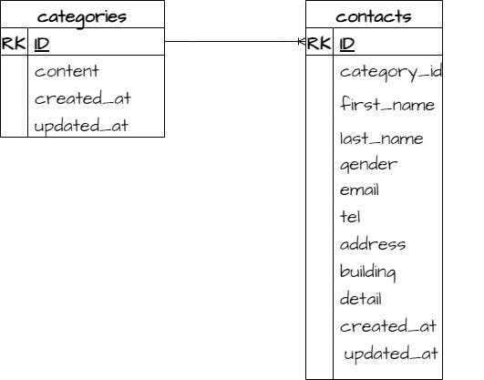

# laravel-confirm-test
# アプリケーション名
お問い合わせフォーム
## 環境構築
- Dockerのビルドからマイグレーション、シーディングまでを記述する
docker+compose up -d --build 
composer install
.envの環境変数を変更
php artisan key:
php artisan make:migration create_contacts_table
php artisan make:migration create_categories_table
php artisan migrate
composer require laravel/fortify
php artisan vendor:publish --provider="Laravel\Fortify\FortifyServiceProvider"
composer require laravel-lang/lang:~7.0 --dev
cp -r ./vendor/laravel-lang/lang/src/ja ./resources/lang/
php artisan make:controller AuthController
php artisan make:controller CategoryController
php artisan make:controller ContactController
php artisan make:request CategoryRequest
php artisan make:request ContactRequest
php artisan make:request LoginRequest
php artisan make:request RegisterRequest
php artisan make:model Category
php artisan make:model Contact
php artisan make:factory ContactFactory
php artisan make:seeder CategoriesTableSeeder
php artisan db:seed

## 使用技術(実行環境)
- 例) Laravel 8.x(言語やフレームワーク、バージョンなどが記載されていると良い)
Laravel Framework 8.83.27
php 7.4.9
MySQL 8.0.26
## ER図
< - - - 作成したER図の画像 - - - >

## URL
- 開発環境：http://localhost/
phpMyAdmin:http://localhost:8080/